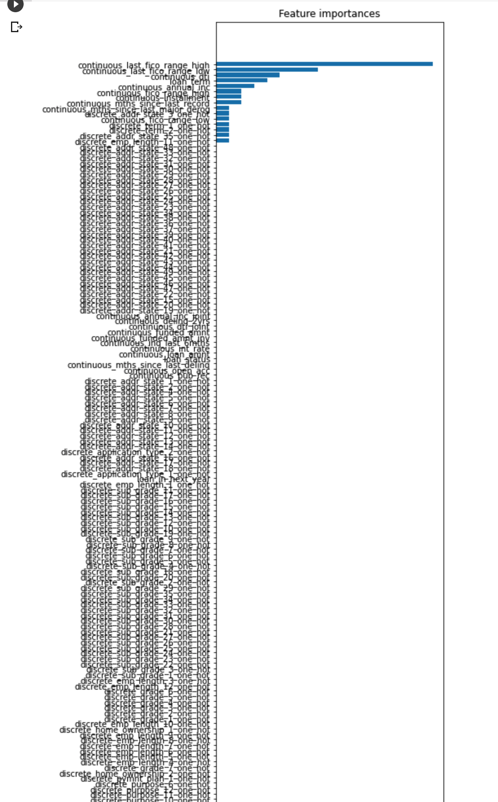

## 一期机器学习毕业项目-贷款违约预测
G20200389030141 何文迁

### Baseline
上次作业使用 LightGBM 进行调参,最后由一下参数组合得到调优结果如下:
>{'num_thread':4,'num_leaves':27,'metric':'binary','objective':'binary','num_round':1000,'learning_rate':0.012,'min_data_in_leaf':20,'min_sum_hessian_in_leaf':0.001,'max_bin': 37,'bagging_freq': 30,'feature_fraction':1.0,'bagging_fraction':0.55,'lambda_l1':0.0,'lambda_l2':0.1}
>0.07935999999999999


### 构建衍生变量
构建衍生变量基本遵循了解业务 -> 探索数据 -> 修复异常数据 -> 构建衍生变量的流程进行。首先需要尽可能熟悉一下业务，所以查阅了相关资源（个别文献引用见底部）。很快发现 continuous_last_fico_range_high 参数存在为 0 的情况，按理说这个是不应该的，决定根据判断，采用关联的 continuous_fico_range_high 参数填充，如下：
```
#如果continuous_last_fico_range_high 为 0 则用 continuous_fico_range_high 填充
fill_last = lambda s: s['continuous_fico_range_high'] if s['continuous_last_fico_range_high'] == 0.0 else s['continuous_last_fico_range_high']
data['continuous_last_fico_range_high'] = data.apply(fill_last, axis=1)
#data['continuous_last_fico_range_high'].value_counts()
```
其它值也有缺失的情况，不过暂时没发现业务上特殊的关系，所以一律采用后值填充法处理，如下：
```
data = data.fillna(method='pad')
```
接下来开始构建衍生变量，容易发现数据集中没有贷款期限，这个属性应该是很常用的，直接构建一个：
```
#构建衍生变量-贷款期限
data['continuous_installment'].value_counts().head(30)
data['loan_term'] = data['continuous_loan_amnt'] / data['continuous_installment']
#这里居然发现会有分期 406 期和 479 期的，感觉就像是异常数据一样，后面我再试下去掉是不是会更好些
data['loan_term'] = data['loan_term'].apply(lambda x: round(x))
#好家伙分期就没有少于 12 期的，外国人这么牛逼的吗
#data['loan_term'].value_counts()
```
然后忽然想到，我们手上有贷款人的年收入以及分期数，那么以接下来一年为单位，计算贷款人未来一年内需要还款的额度会不会有意义呢。这个想法跟参数中的每月需还款金额的差别是额外考虑此时贷款方的已欠款金额在内，不过这个衍生变量是否有意义自己心理没底，待会做一下特征筛选看看，构建代码如下：
```
#未来一年内的需还款额度，一年内预期需还款 + 当前欠款y
#data['continuous_open_acc'].value_counts()
data['loan_in_next_year'] = data['continuous_installment'] * 12 + data['continuous_open_acc']
```
然后我还注意到一个业务逻辑，在美国放贷业务中，fico 的评分是有区分几个等级的，如下：
* < 580 = Poor/差：信用分数远低于美国消费者平均水平，通常申请不到信用卡、贷款，或需要先交押金。
* 580 - 669 = Fair/一般：信用分数低于美国平均水平，能申请到贷款但通常利息较高。
* 670 - 739 = Good/好：信用分数接近或略高于美国平均水平，多数贷方认为这人信用不错。
* 740 - 799 = Very Good/非常好：信用分数高于美国平均水平，贷方认为这是非常可靠的借款人。
* 800+ = Exceptional/最优秀：信用分数位居榜首，贷方眼中非常优异的借款人，可以给予最好的优惠和利率。

那么我想构建一个衍生变量来形容信用梯度，因为我认为在放贷审核过程中，工作人员以 fico 信用等级作为参考更多于具体的评分，信用等级隐含更能代表放贷方对贷款方的“信心”。
```
#针对 fico 分箱
bins = [579, 669, 739, 799, 999]
labels = [1, 2, 3, 4, 5]
data['fico_level'] = pd.cut(data['continuous_fico_range_low'], bins, labels).cat.codes
```
然后检查前后两次信用评分变化幅度，发现绝大部分变动都在[-70,70]以内，近似期望为 0 的正态分布，额这个没有特别想清楚这里可能的现实逻辑，所以先搁置，也许可以作为后来持续优化的一个思路。

#### 特征选择
接着尝试做一下特征选择，特别是想看下添加的衍生变量 loan_in_next_year 是否有意义。我采用的方法如下：



看到这个我人都麻了，以我粗浅的知识判断，这是只有十几个变量被认为对结果有较大的影响？（容我多看看这方面的资料，再回来补充这里的分析），其中就包括自己刚刚构建的新衍生变量 loan_in_next_year。
假设我这个做法是有问题的，那么此时不应该清除大部分特征数据，反之仅需要保留少数特征即可。我决定先保留试试看，因为如果大部分特征意义不大的话，也就是模型变得更慢而已，对最终的精度没有影响。打算在调参过程中观察现象来验证这个特征重要性的正确性。

### 进一步调参
处理完衍生变量，开始正式进行调参，本次我准备用 XGBoost 和 LightGBM 调参，再使用 stacking 集成。

#### XGBoost 调参
开始调参前先做的就是找找看前人的经验分享，站在巨人的肩膀上嘛。总结下来调参有大概以下的步骤：
1. 选用较大 learning_rate 初步调参
2. 针对 max_depth/min_child_weight 等一般参数调参
3. 针对 reg_lambda、reg_alpha 两个正则化参数调参
4.  缩小学习率精确搜索相对理想的参数

开始执行，首先审视自己的需求，确定 booster 选择默认的树模型，slient 保持默认值 0。
先对 learning_rate 做一次初步搜索，其它参数使用默认值，调试代码如下：
```
import matplotlib.pyplot as plt
from sklearn import datasets
from sklearn.metrics import accuracy_score
from xgboost import XGBClassifier
from xgboost import plot_importance
from sklearn import metrics

for learning_rate in [0.05, 0.1, 0.2, 0.3, 0.5]:
  model = XGBClassifier(learning_rate=learning_rate,
                        min_child_weight = 1, #叶子节点最小权重
                        max_depth=6,          #树深
                        gamma=0.,             #惩罚项中叶子结点个数前的参数，节点分裂的最小损失函数下降值
                        subsample=1,          #每棵树随机采样的比例
                        colsample_bytree=1,   #所有特征建立决策树，类似 lgbm 的 max_feature
                        scale_pos_weight=1    #解决样本个数不平衡的问题
                        )
  
  model.fit(X_train, y_train)
  y_test, y_pred = y_test, model.predict(X_test)

  print("Param: %s => Accuracy : %.4g" % (learning_rate, metrics.accuracy_score(y_test, y_pred)))
```
得到结果如下
>Param: 0.05 => Accuracy : 0.9174
Param: 0.1 => Accuracy : 0.9179
Param: 0.2 => Accuracy : 0.918
Param: 0.3 => Accuracy : 0.9146
Param: 0.5 => Accuracy : 0.9105

显然 learning_rate 在 0.1 到 0.2 之间获得相对较好的效果，在此附近再做一次搜索如下：
```
for learning_rate in [0.1, 0.13, 0.15, 0.18, 0.2, 0.23]: 
  ...
```
得到：
>Param: 0.1 => Accuracy : 0.9179
Param: 0.13 => Accuracy : 0.9183
Param: 0.15 => Accuracy : 0.9183
Param: 0.18 => Accuracy : 0.9171
Param: 0.2 => Accuracy : 0.918
Param: 0.23 => Accuracy : 0.9156

因为后面还是要对 learning_rate 进行一次细化，所以这里决定采用较大的学习率 0.15 作为接下来调参基准。然后对 max_depth 和 min_child_weight 进行调参：
```
for min_child_weight in [1, 3, 5, 10, 30]: 
  for max_depth in [4, 8, 12, 24, 48]:
    ...

	print("Param: %s, %s => Accuracy : %.4g" % (min_child_weight, max_depth, metrics.accuracy_score(y_test, y_pred))) 
```
结果发现跑得超级慢，原因是 max_depth 取 24 和 48 太深了，以致半天才出来一个结果，观察两轮发现这两个值会是模型效果明显下降。为了节省时间和算力直接去掉它，选择细化 2-18 范围测试，如下：
```
for min_child_weight in [1, 3, 5, 10, 30]: 
  for max_depth in [2, 4, 6, 8, 12, 18]:
    ...
```
得到结果：
>Param: 1, 2 => Accuracy : 0.9171
Param: 1, 4 => Accuracy : 0.918
Param: 1, 6 => Accuracy : 0.9183
Param: 1, 8 => Accuracy : 0.9153
Param: 1, 12 => Accuracy : 0.9148
Param: 3, 2 => Accuracy : 0.917
Param: 3, 4 => Accuracy : 0.9179
Param: 3, 6 => Accuracy : 0.9167
Param: 3, 8 => Accuracy : 0.9161
Param: 3, 12 => Accuracy : 0.9137
Param: 5, 2 => Accuracy : 0.917
Param: 5, 4 => Accuracy : 0.9177
Param: 5, 6 => Accuracy : 0.9165
Param: 5, 8 => Accuracy : 0.9151
Param: 5, 12 => Accuracy : 0.9143
Param: 10, 2 => Accuracy : 0.9172
Param: 10, 4 => Accuracy : 0.918
Param: 10, 6 => Accuracy : 0.9174
Param: 10, 8 => Accuracy : 0.9169
Param: 10, 12 => Accuracy : 0.9162
Param: 30, 2 => Accuracy : 0.9173
Param: 30, 4 => Accuracy : 0.9185
Param: 30, 6 => Accuracy : 0.9174
Param: 30, 8 => Accuracy : 0.9176
Param: 30, 12 => Accuracy : 0.9172

整体上这些参数组合对结果影响不是很大，在 min_child_weight=30，max_depth=4 处获得小小的提升：0.9185。不过在这个过程中发现 learning_rate 和 max_depth 整体上呈现 learning_rate 越大，max_depth 越小效果越好的趋势。同时细化调参时发现在 max_depth in (3,4) 时往往取得相对较好效果，且一般是 max_depth=3 稍好，鉴于我使用的是树模型基本可以认为当前训练集数据表现较为简单。这里似乎能作为证实当前特征数据集中仅有少数特征有意义的证据之一，而且可能不多的特征数据分布也表现为可分类类别较少。然后因为 max_depth=3 和 max_depth=4 的结果相近，为防止 max_depth 太小导致欠拟合，所以参数选择上倾向 max_depth=4。

接着针对 gamma、subsample、colsample_bytree 做参数搜索。因为都是枯燥的调参跑数据所以接下来没有特殊情况就长话短说了，我打算测试 gamma 在 0.1~0.5 内，subsample 和 colsample_bytree 在 0.6~1.0 内的效果。
结果表明 gamma 取值对本次模型结果没有影响。而 subsample 和 colsample_bytree 分别在取值 0.7, 0.9 时获得提升 0.9196。

最后对 reg_lambda 和 reg_alpha 做优化：
>Param: 1e-05, 1e-05 => Accuracy : 0.9203
Param: 1e-05, 0.01 => Accuracy : 0.9211
Param: 1e-05, 0.1 => Accuracy : 0.9206
Param: 1e-05, 1 => Accuracy : 0.9207
Param: 1e-05, 100 => Accuracy : 0.9203
Param: 0.01, 1e-05 => Accuracy : 0.9203
Param: 0.01, 0.01 => Accuracy : 0.9211
Param: 0.01, 0.1 => Accuracy : 0.92
Param: 0.01, 1 => Accuracy : 0.9207
Param: 0.01, 100 => Accuracy : 0.9203
Param: 0.1, 1e-05 => Accuracy : 0.9204
Param: 0.1, 0.01 => Accuracy : 0.9204
Param: 0.1, 0.1 => Accuracy : 0.9212
Param: 0.1, 1 => Accuracy : 0.9207
Param: 0.1, 100 => Accuracy : 0.9202
Param: 1, 1e-05 => Accuracy : 0.9194
Param: 1, 0.01 => Accuracy : 0.9194
Param: 1, 0.1 => Accuracy : 0.9213
Param: 1, 1 => Accuracy : 0.921
Param: 1, 100 => Accuracy : 0.9205
Param: 100, 1e-05 => Accuracy : 0.9207
Param: 100, 0.01 => Accuracy : 0.9207
Param: 100, 0.1 => Accuracy : 0.9207
Param: 100, 1 => Accuracy : 0.9198
Param: 100, 100 => Accuracy : 0.9204

上述表明在 reg_lambda=1，reg_alpha=0.1 处获得最优准确率 0.9213。最后缩小学习率尝试优化模型发现 0.155 是相对较优的参数，得到最终结论：通过 XGBoost 训练模型在以下参数组合取的测试集相对较好结果：0.9214。
```
model = XGBClassifier(learning_rate=0.155,
                      min_child_weight = 30,
                      max_depth=4,
                      gamma=0,
                      subsample=0.7,
                      colsample_bytree=0.9,
                      reg_lambda=1,
                      reg_alpha=0.1)
accuracy: 0.9214
```
至此 XGBoost 调参结束，整体上感觉除了学习率和树深参数外，其它参数对准确率提升有限。接下来看看 LightGBM 的调参是否会好一些。


#### LightGBM 调参
因为之前作业已经提交过 LightGBM 调参了，这里跳过步骤直接总结。本次调参使用的是王老师分享代码调参，顺便再过一遍代码。过程中发现 min_sum_hessian_in_leaf 参数取不同值对结果没有影响，这是比较奇怪的。同时调参到 min_data_in_leaf 参数时发现收敛的树棵数急剧缩小，跟 XGBoost 中 max_depth 偏小的逻辑一致，看起来数据过于简单了，后续再做优化的话估计得想办法构造更复杂的衍生变量。 
最后得到的调参结果如下：

>{'num_thread': 0, 'num_leaves': 6, 'metric': 'binary', 'objective': 'binary', 'num_round': 300, 'learning_rate': 0.07, 'min_data_in_leaf': 8, 'min_sum_hessian_in_leaf': 0.001, 'max_bin': 90, 'bagging_freq': 70, 'feature_fraction': 1, 'bagging_fraction': 0.3, 'lambda_l1': 0.001, 'lambda_l2': 0.001}
0.07934931127195646

调参结果表明没有特别明显的提升，可能是一样的调参手法的关系，比 deadline 仅仅好一丢丢。后面得看下 Stacking 的结果了。

### Stacking
Stacking 是抠的 sklearn 上面的代码，英语渣没找到中文文档难过得很，具体是依样画葫芦使用两个模型的分类器，套入之前调参的参数进行集成，在对输出结果做平均得到最后准确率。代码如下，详情请看引用的 colab 笔记地址。
```
import warnings
warnings.filterwarnings('ignore')
import itertools
import numpy as np
from sklearn import datasets
from sklearn.linear_model import LogisticRegression
from mlxtend.classifier import StackingClassifier
from sklearn.model_selection import cross_val_score, train_test_split
from lightgbm import LGBMClassifier
from xgboost.sklearn import XGBClassifier

y = data['loan_status'].values
X = data.drop(columns=['loan_status']).values

xgb = XGBClassifier(learning_rate=0.155,
                      min_child_weight = 30,
                      max_depth=4,
                      gamma=0,
                      subsample=0.7,
                      colsample_bytree=0.9,
                      reg_lambda=1,
                      reg_alpha=0.1)

lgbm = LGBMClassifier(num_thread = 0,num_leaves =24,objective ='binary',
         num_round =100,learning_rate=0.25,min_data_in_leaf =10,
         min_sum_hessian_in_leaf =0.001,max_bin = 150,bagging_freq = 10,
         feature_fraction =0.9,bagging_fraction =0.3)
lr = LogisticRegression()
sclf = StackingClassifier(classifiers=[xgb, lgbm], meta_classifier=lr)

label = ['XGBoost', 'LightGBM', 'Stacking Classifier']
clf_list = [xgb, lgbm, sclf]

clf_cv_mean = []
clf_cv_std = []

for clf, label in zip(clf_list, label):

    scores = cross_val_score(clf, X, y, cv=5, scoring='accuracy')
    print("Accuracy: %.2f (+/- %.2f) [%s]" %(scores.mean(), scores.std(), label))
    clf_cv_mean.append(scores.mean())
    clf_cv_std.append(scores.std())

print(clf_cv_mean)
print(clf_cv_std)
```
>Accuracy: 0.92 (+/- 0.00) [XGBoost]
Accuracy: 0.92 (+/- 0.01) [LightGBM]
Accuracy: 0.92 (+/- 0.00) [Stacking Classifier]
[0.9235000000000001, 0.920736, 0.922672]
[0.00293039438224718, 0.00295965885805284, 0.002821073147690327]

### 总结
多次训练下来，经过模型集成得到的结果最好表现会比 deadline 提升了 0.2 个百分点，估计跟数据做 shuffle 和 split 的操作也有关系，也不知道是好还是坏。希望最后有相对标准的答案公布呢，想对比看下自己哪块欠缺。
这次作业尝试走完整个机器学习的项目流程，过程中遇到很多一看就会一做就懵的点。好歹坚持下来了，虽然深度学习的部分还有很多一知半解哈哈。最后想感谢不厌其烦解答的老师们，大家辛苦啦。

### 问题
1. 直到最后的结果输出，似乎我验证了自己关于【数据集数据分布较为简单、仅有少数特征有意义】的观点，但其中还是有疑问的：就是自己对特征选择的做法是否适合当前场景，而且从学习角度出发老师大可不必给我们准备一堆 one-hot 后没意义的特征数据。总感觉自己哪里走岔了，请老师指点。
2. 调参时想到 XGBoost 中如果没有对 lambda 和 alpha 参数进行调参，而在 LightGBM 中对 lambda_l1 和 lambda_l2 进行了调参，是否说明我对两个模型的调参力度不一致呢？深层问题是：要求多个模型的调参力度一致是否该从使用参数和调参粒度方面衡量（一开始我想的是时间和精力分配。。。）
3. 在某一次调参中，我发现 XGBoost 的 learning_rate 越大模型表现越好，原则来说接下来肯定要继续加大 learning_rate 做进一步的参数搜索，但是没理解这个现象（learning_rate 越大模型表现越好）说明了什么，请老师解惑。


### 引用
[美国 fico 评分等级说明](https://www.dealmoon.com/guide/762096)
[colab 作业代码](https://colab.research.google.com/drive/1bcJG4kqJinf31xf10TWQztRYhd50XzJn#scrollTo=CN_IiJ9dvOTk)
[xgboost 官方调参指南](https://xgboost.readthedocs.io/en/latest/tutorials/param_tuning.html)
[好难啃的 sklearn 文档](https://scikit-learn.org/stable/supervised_learning.html#supervised-learning)